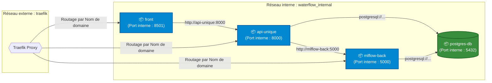
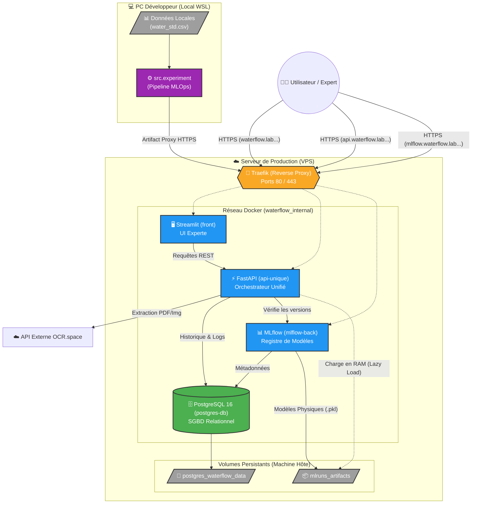

# Waterflow 2
## Centralisation API Unique, Ingestion OCR & MLOps

## Contexte du projet
Ce projet est réalisé dans le cadre d'un [bachelor en développement en intelligence artificielle](https://laplateforme.io/bachelor-it/developpeur-en-intelligence-artificielle/).
Il implémente :
- un pipeline complet de Machine Learning destiné à prédire la potabilité de l'eau à partir de caractéristiques physico-chimiques.
- une architecture industrielle multiniveau hautement découplée et conteneurisée via **Docker Compose** visant à automatiser :
    - l'analyse
    - le suivi
    - l'ingestion OCR
    - la prédiction.

Réalisé sous l'environnement WSL2, le système intègre :
- une interface utilisateur réactive (Streamlit).
- une **API Unique unifiée (FastAPI)** gérant :
    - l'ingestion des données (Data)
    - l'extraction documentaire (OCR)
    - les prédictions (Model) protégées par des garde-fous sanitaires.
- un serveur de tracking et registre de modèles d'Intelligence Artificielle (MLflow) connecté à une base PostgreSQL.

## Jeu de données
Le jeu de données contient :
- 3 276 étendues d'eau différentes (observations)
- 9 mesures physico-chimiques de la qualité de l'eau (features)
- une étiquette binaire (1 = potable, 0 = non potable)


Il n'est pas stocké dans le dépôt Git pour des raisons d'optimisation de l'espace. Il doit être [téléchargé directement](https://drive.google.com/file/d/1C-tYJcgJDx5AuF7_oz7U4bbY0PERiFLo/view), ainsi que [son descriptif](https://drive.google.com/file/d/1VSRPKK6ys0Kn3gSYDHgrQogdBAHXcEKg/view).


---

## Quickstart (Production)

Cette procédure permet de démarrer immédiatement l'application complète en s'appuyant sur l'infrastructure Docker pré-configurée.

### 1. Démarrer l'infrastructure et l'API
Assurez-vous que **Docker Desktop** (avec intégration WSL2) est actif, puis déployez l'environnement complet (Base de données, serveur MLflow, API Unique et Front Streamlit) :
```bash
docker compose up -d
```

L'interface graphique de suivi MLflow
https://mlflow.waterflow.lab.zanza-creation.com

L'API Unique et sa documentation Swagger
https://api.waterflow.lab.zanza-creation.com/docs

L'interface experte Streamlit
https://waterflow.lab.zanza-creation.com

---

## Stack Technique Fixe

* **Système d'exploitation :** Windows 11 avec WSL2 (Ubuntu)
* **Langage :** Python 3.12 (scikit-learn, xgboost, pandas, fastapi, streamlit)
* **Gestionnaire de packages :** `uv` (Astral)
* **MLOps :** MLflow (Tracking & Model Registry)
* **Conteneurisation & Persistance :** Docker, Docker Compose & PostgreSQL 16

### Structure des Données

Les données sont segmentées et partagées avec les conteneurs dans le répertoire `data/` :

|||
|-|-|
| `data/raw/water_potability.csv` | Jeu de données brut d'origine.|
| `data/processed/water_imputed.csv` | Données imputées par la médiane (pour Random Forest, XGBoost)|
| `data/processed/water_std.csv` | Données imputées et standardisées (pour Régression Logistique, MLP Classifier)|


### Architecture de la Stack Réseau



L'infrastructure applicative est segmentée en services isolés communiquant par requêtes HTTP :

| Composant | Framework / Image | Port | Mode de déploiement | Rôle principal |
| --- | --- | --- | --- | --- |
| **Interface UI** | Streamlit (`front`) | 8501 | Conteneur Docker | Présentation IHM, filtres experts et téléversement de rapports labo (OCR). |
| **API** | FastAPI (`api-unique`) | 8000 | Conteneur Docker | Point d'entrée unifié : gestion clients, ingestion OCR, persistance SQL et inférence IA. |
| **Registre MLOps** | MLflow (`mlflow-back`) | 5000 | Conteneur Docker | Gestion du cycle de vie des modèles, du tracking d'expériences et du Model Registry. |
| **Base de Données** | PostgreSQL 16 (`postgres-db`) | 5432 | Conteneur Docker | SGBDR industriel unifié (Stockage applicatif métier + Tables de métadonnées MLflow). |

---

## Architecture MLOps, Persistance Réseau & Sécurité



### 1. Découplage BDD (Métadonnées) vs Volume Local (Artefacts)

Afin d'éviter l'encombrement des tables relationnelles par des binaires lourds (`.pkl`), l'architecture sépare physiquement le stockage :

* **Backend Store (BDD) :** MLflow est interconnecté à l'instance PostgreSQL. Il structure nativement ses tables SQL dans la base `waterflow_db`.
* **Artifact Store (Volume) :** Les fichiers sérialisés des modèles sont enregistrés sur le disque de la machine hôte dans le répertoire local `./mlruns_artifacts`. Ce dossier est monté comme volume partagé sur `mlflow-back`, `mlops-training` et `api-unique`.
* **Lazy Loading Dynamique :** L'API charge les modèles en mémoire (RAM) à la volée depuis le volume partagé lors de la première requête de prédiction, garantissant une résilience totale aux redémarrages.


---

## Scénarios d'Exécution & Cycle de Vie

**Pré-requis :** Créez un fichier `.env` à la racine du projet :

```env
POSTGRES_USER=admin_waterflow
POSTGRES_DB=waterflow_db
POSTGRES_PASSWORD=mot_de_passe
OCR_SPACE_API_KEY=Cle_Api_Ocr_Space
SECRET_KEY=Une_Cle_De_Session_Securisee
```
### Scénario A : Entraînement Local et Remote Tracking (Mode Production Recommandé)
Dans cette architecture distribuée, l'entraînement ne se fait pas sur le VPS pour préserver ses ressources CPU/RAM. Les calculs sont réalisés en local (via WSL), et les modèles sont expédiés en toute sécurité vers le serveur distant (VPS) via HTTPS.

Sur le VPS, lancez l'infrastructure de base :

1 Lancer l'infrastructure de base et l'API :
```Bash
docker compose up -d
```
2 Sur votre poste de développement (Local WSL), assurez-vous d'avoir les données dans `data/processed/`, puis lancez le pipeline en forçant l'URI cible du VPS :

```Bash
MLFLOW_TRACKING_URI=https://mlflow.waterflow.lab.zanza-creation.com uv run python -m src.experiment
```

### Scénario B : Entraînement 100% Local (Mode Pipeline Isolé)
Si vous ne possédez pas de VPS et souhaitez faire tourner l'intégralité du projet sur votre propre machine :

1 Démarrez la base de données et MLflow :

```Bash
docker compose up -d postgres-db mlflow-back
```
2 Lancez le conteneur d'entraînement éphémère (qui simulera le pipeline MLOps en local) :

```Bash
docker compose up mlops-training
```
3 Une fois l'entraînement terminé (exited with code 0), lancez l'API et le Front :

```Bash
docker compose up -d api-unique front
```

*Note : Ce conteneur intègre une temporisation native (`sleep 15`) pour attendre la pleine disponibilité du serveur MLflow avant de lancer les calculs.* Il entraîne les 4 architectures, publie les métriques et écrit les artefacts binaires dans le volume partagé avant de s'arrêter proprement (`exited with code 0`).

Accès aux interfaces de Production :

Registre MLflow : https://mlflow.waterflow.lab.zanza-creation.com
API Unifiée (Swagger) : https://api.waterflow.lab.zanza-creation.com/docs
Portail Expert (Streamlit) : https://waterflow.lab.zanza-creation.com

### Couche "Garde-fou Métier" (Business Rules)

Une couche de règles métiers strictes est exécutée en amont de l'inférence. Basée sur les seuils de l'OMS, elle rejette automatiquement l'échantillon (sans faire appel à l'IA) si les limites vitales sont dépassées :

* pH < 6.5 ou pH > 8.5
* Turbidité > 5.0 NTU
* Chloramines > 4.0 mg/L
* Trihalométhanes > 80 ppm


## Guide de lancement : Développement vs Production

Pour piloter le projet, il est important de choisir le mode de lancement adapté :

### 1. Mode Production (Déploiement complet)
Pour une exécution réelle (VPS) ou pour tester l'architecture complète avec ses conteneurs isolés (via Traefik).

```bash
docker compose up -d
```
Cela lance tous les services (BDD, MLflow, API et Front) de manière isolée et persistante.
L'accès à l'API se fait alors sur : https://api.waterflow.lab.zanza-creation.com/docs

### 2. Mode Développement (Hot Reload en local)
Utile si l'on modifie le code source (src/ ou front/) pour voir les changements s'appliquer en temps réel sur la machine locale, sans avoir à reconstruire les images Docker.

**Étape A : Démarrer l'infrastructure de base**
Lancez uniquement les bases de données (sans l'API ni le Front via Docker) :

```Bash
docker compose up -d postgres-db mlflow-back
```
(Note : Si le conteneur de l'API était déjà en cours d'exécution, arrêtez-le préalablement avec docker compose stop api-unique)

**Étape B : Démarrer l'API en local**
Lancez l'API unifiée nativement via uvicorn. Le mode --reload redémarrera l'API instantanément à chaque sauvegarde de fichier :

```Bash
uv run uvicorn src.api:app --host 127.0.0.1 --port 8000 --reload
```
Étape C : Démarrer l'interface experte (Optionnel)
Dans un nouveau terminal, lancez le frontend Streamlit :

```Bash
uv run streamlit run front/app.py
```
