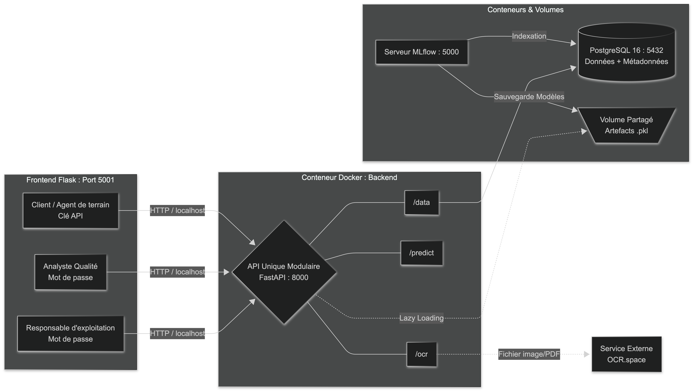
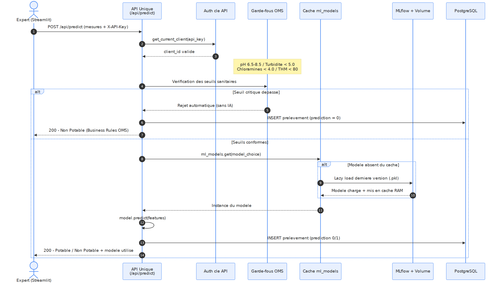

# Drink safe
## Centralisation API Unique, Ingestion OCR & MLOps

## Contexte du projet
Ce projet est réalisé dans le cadre d'un [bachelor en développement en intelligence artificielle](https://laplateforme.io/bachelor-it/developpeur-en-intelligence-artificielle/).
Il implémente :
- un pipeline complet de Machine Learning destiné à prédire la potabilité de l'eau à partir de caractéristiques physico-chimiques.
- une architecture industrielle multi-niveau hautement découplée et conteneurisée via **Docker Compose** visant à automatiser :
- l'analyse
- le suivi
- l'ingestion OCR
- la prédiction.

Réalisé sous l'environnement WSL2, le système intègre :
- une interface utilisateur réactive (Flask).
- une **API Unique unifiée (FastAPI)** gérant :
    - l'ingestion des données (Data)
    - l'extraction documentaire (OCR)
    - les prédictions (Model) protégées par des garde-fous sanitaires.
- un serveur de tracking et registre de modèles d'Intelligence Artificielle (MLflow) connecté à une base PostgreSQL.

## Architecture globale

L'application est segmentée en couches isolées (présentation, logicielle/inférence, données) communiquant par HTTP. La couche données sépare le stockage des métadonnées MLflow (PostgreSQL) de celui des artefacts binaires (volume partagé).



## Jeu de données
Le jeu de données contient :
- 3 276 étendues d'eau différentes (observations)
- 9 mesures physico-chimiques de la qualité de l'eau (features)
- une étiquette binaire (1 = potable, 0 = non potable)

recall sur la classe non-potable est la métrique métier prioritaire ici : minimiser les cm_fp.
 sklearn calcule le recall sur la classe positive (1 = Potable) par défaut, ce qui ne correspond pas à cet objectif.


Il n'est pas stocké dans le dépôt Git pour des raisons d'optimisation de l'espace. Il doit être [téléchargé directement](https://drive.google.com/file/d/1C-tYJcgJDx5AuF7_oz7U4bbY0PERiFLo/view), ainsi que son [descriptif](https://drive.google.com/file/d/1VSRPKK6ys0Kn3gSYDHgrQogdBAHXcEKg/view).


---

## Quickstart (Production)

Cette procédure permet de démarrer immédiatement l'application complète en s'appuyant sur l'infrastructure Docker pré-configurée.

### 1. Démarrer l'infrastructure et l'API
Démarrer **Docker Desktop**
Avec intégration WSL2 : settings/ressources/wsl integration

**Déployement de l'environnement**
- Base de données
- serveur MLflow
- serveur API Unique
```bash
docker compose up -d
```

### 2. Si primo activation seulement : génerer les comptes admins
Peupler la base de donées avec les profils "Analyste" et "Responsable d'Exploitation"
```bash
uv run scripts/auth/seed_admins.py
```
`uv run` lance un environnement virtuel complètement isolé et ne charge pas systématiquement le fichier `.env`.
Dans ce cas, il faut forcer l'outil `uv` à injecter lui-même les variables du fichier `.env` au moment de lancer le script grâce au paramètre `--env-file`:
```bash
uv run --env-file .env python scripts/auth/seed_admins.py
```

### 2. Interface Frontend (Streamlit)

Déployer l'IHM finale destinée aux experts et administrateurs depuis `localhost` :


```bash
cd front && uv run python app.py
# ou
uv run flask --app front/app run --debug --port 5001
```

Interface utilisateur
http://127.0.0.1:5001

L'API Unique et sa documentation Swagger
http://127.0.0.1:8000/docs

L'interface de suivi MLflow
http://127.0.0.1:5000

Interface monitoring
http://localhost:3000/

---

## Stack Technique Fixe

* **Système d'exploitation :** Windows 11 avec WSL2 (Ubuntu)
* **Langage :** Python 3.12 (scikit-learn, xgboost, pandas, fastapi, streamlit)
* **Gestionnaire de packages :** `uv` (Astral)
* **MLOps :** MLflow (Tracking & Model Registry)
* **Conteneurisation & Persistance :** Docker, Docker Compose & PostgreSQL 16

### Structure des Données

Les données sont segmentées et partagées avec les conteneurs dans le répertoire `data/` :

|||
|-|-|
| `data/raw/water_potability.csv` | Jeu de données brut d'origine|
| `data/processed/water_imputed.csv` | Données imputées par la médiane — base d'entraînement des 4 modèles|
| `data/processed/water_std.csv` | Version standardisée (référence EDA). En production, la standardisation requise par la Régression Logistique et le MLP est **intégrée à leur `Pipeline` scikit-learn**, donc appliquée à l'identique à l'entraînement et à l'inférence.|

### Architecture de la Stack Réseau
L'infrastructure applicative est segmentée en services isolés communiquant par requêtes HTTP :

<!-- | Composant | Framework / Image | Port | Mode de déploiement | Rôle principal |
| :--- | :--- | :--- | :--- | :--- |
| **Interface UI** | Flask | 5001 | Hôte local (WSL2) | Présentation IHM (Client, Analyste, Exploitation) et téléversement OCR. |
| **API Unique** | FastAPI (`api`) | 8000 | Conteneur Docker | Point d'entrée unifié : gestion clients, ingestion OCR, persistance SQL et inférence IA. |
| **Registre MLOps** | MLflow (`mlflow`) | 5000 | Conteneur Docker | Gestion du cycle de vie des modèles, du tracking d'expériences et du Model Registry. |
| **Base de Données** | PostgreSQL 16 (`postgres`) | 5432 | Conteneur Docker | SGBDR industriel unifié (Stockage applicatif métier + Tables de métadonnées MLflow). |
| **Pipeline ML** | Python (`mlops-training`) | Aucun | Conteneur Docker | Environnement éphémère d'entraînement et d'équilibrage des modèles. |
| **Métriques** | Prometheus | 9090 | Conteneur Docker | Scraping des métriques exposées par l'API (`/metrics/`) : volumes, erreurs, latence. |
| **Supervision** | Grafana | 3000 | Conteneur Docker | Dashboard RED (Rate / Errors / Duration) et suivi de la santé OCR (`ocr_failures_total`). | -->

| Composant | Framework / Image | Port | Mode de déploiement | Rôle principal |
|---|---|---|---|---|
| **Interface UI** | Flask | 5001 | Hôte local (WSL2) | Présentation IHM (Client, Analyste, Exploitation) et téléversement OCR. |
| **API Unique** | FastAPI (`api`) | 8000 | Conteneur Docker | Point d'entrée unifié : gestion clients, ingestion OCR, persistance SQL et inférence IA. |
| **Registre MLOps** | MLflow (`mlflow`) | 5000 | Conteneur Docker (Volume partagé) | Gestion du cycle de vie des modèles et Model Registry. |
| **Base de Données** | PostgreSQL 16 (`postgres`) | 5432 | Conteneur Docker (Volume persistant) | SGBDR unifié (Stockage applicatif + Métadonnées MLflow). |
| **Supervision** | Prometheus | 9090 | Conteneur Docker (Volume persistant) | Collecte et sauvegarde de l'historique des métriques temporelles. |
| **Dashboard RED** | Grafana | 3000 | Conteneur Docker (Volume persistant) | Tableaux de bord de santé du système pour le Responsable d'exploitation. |
| **Pipeline ML** | Python (`mlops-training`) | Aucun | Conteneur Docker | Environnement éphémère d'entraînement et d'équilibrage des modèles. |


---

## Architecture MLOps, Persistance Réseau & Sécurité

### 1. Découplage BDD (Métadonnées) vs Volume Local (Artefacts)

Afin d'éviter l'encombrement des tables relationnelles par des binaires lourds (`.pkl`), l'architecture sépare physiquement le stockage :

* **Backend Store (BDD) :**
MLflow est interconnecté à l'instance PostgreSQL. Il structure nativement ses tables SQL dans la base `waterflow_db`.
* **Artifact Store (Volume) :**
Les fichiers sérialisés des modèles sont enregistrés sur le disque de la machine hôte dans le répertoire local `./mlruns_artifacts`   
Ce dossier est monté comme volume partagé sur `mlflow`, `mlops-training` et `api`.
* **Préchargement et Lazy Loading :**
Au démarrage, l'API précharge en mémoire (RAM) la dernière version de chaque modèle enregistré dans le registre MLflow. Si un modèle est absent du cache (registre mis à jour à chaud), un mécanisme de lazy loading le récupère à la volée depuis le volume partagé lors de la première requête de prédiction, garantissant la résilience aux redémarrages.

### 2. Parade contre le DNS Rebinding (Erreur HTTP 403)

Les serveurs HTTP exécutés dans un réseau Docker isolé rejettent par défaut les requêtes contenant des en-têtes d'hôtes virtuels internes (ex: `Host: mlflow:5000`). Un patch d'interception HTTP surcharge dynamiquement la bibliothèque `requests` dans l'API pour forcer l'en-tête attendu par le serveur et neutraliser ce blocage.

---

## Scénarios d'Exécution & Cycle de Vie

**Pré-requis :** Créer un fichier `.env` à la racine du projet :

```env
POSTGRES_PASSWORD=MonMotDePasseSecurise123!
OCR_SPACE_API_KEY=VotreCleApiOcrSpace
SECRET_KEY=UneCleDeSessionSecurisee
```

### Scénari

#### Entraînement Initial (MLOps Pipeline)

Pour entraîner les modèles et populer le registre MLflow (à exécuter lors du premier déploiement ou pour mettre à jour les modèles) :

1. Vérifier que l'infrastructure de base tourne (`postegres` et `mlflow`).
2. Lancez le conteneur d'entraînement éphémère :

```bash
docker compose up mlops-training
```
---

#### Relancer le pipeline d'entraînement
 générer les nouvelles versions des modèles dans MLflow

 L'option ``--build`` est indispensable chaque fois qu'un fichier Python qui s'exécute dans un conteneur à été modifié :
```bash
docker compose up -d --build mlops-training

# suivre l'entrainement
docker logs -f mlops-training
```
Le conteneur va s'exécuter, ré-entraîner les 4 modèles, enregistrer les nouveaux .pkl dans le volume partagé, calculer les métriques et les envoie à MLflow, puis s'arrêter proprement


Il faut ensuite mettre à jour l'API
"Lazy Loading" : l'API garde les modèles en cache (RAM) après la première prédiction.
Pour la forcer à télécharger les nouveaux modèles, il faut vider le cache en la redémarrant :
```bash
docker restart api
```

---

*Note : Ce conteneur intègre une temporisation native (`sleep 15`) pour attendre la pleine disponibilité du serveur MLflow avant de lancer les calculs.*

Le container `mlops-training` :
- entraîne les 4 architectures
- publie les métriques
- écrit les artefacts binaires dans le volume partagé
- s'arrête proprement (`exited with code 0`).


---

### Couche "Garde-fou Métier" (Business Rules)

Une couche de règles métiers strictes est exécutée en amont de l'inférence. Basée sur les seuils de l'OMS, elle rejette automatiquement l'échantillon (sans faire appel à l'IA) si les limites vitales sont dépassées :

* pH < 6.5 ou pH > 8.5
* Turbidité > 5.0 NTU
* Chloramines > 4.0 mg/L
* Trihalométhanes > 80 ppm

Au-delà du garde-fou, l'inférence interroge **les 4 modèles** et renvoie pour chacun sa prédiction et un **score de probabilité de potabilité** (`predict_proba`). Le verdict retenu est le **consensus** (vote majoritaire ; en cas d'égalité, principe de précaution → Non Potable). Deux voies alimentent ce flux :

- **Saisie directe** : `POST /api/predict/all` (crée le prélèvement et le consensus).
- **Fiche OCR** : `POST /api/ocr/lab-report` crée le prélèvement, puis `POST /api/predict/from-prelevement/{id}` enrichit **la même ligne** avec le consensus (pas de doublon).

<!--  -->


## API REST — endpoints & exemples d'appels

Toutes les routes sont préfixées par `/api` et documentées via Swagger : http://127.0.0.1:8000/docs

| Méthode | Route | Accès | Rôle |
| --- | --- | --- | --- |
| POST | `/api/clients` | Admin | Créer un client + générer sa clé API |
| GET | `/api/clients` | Admin | Lister les clients |
| POST | `/api/measurements` | Clé API | Déposer un prélèvement (saisie structurée) |
| GET | `/api/measurements` | Clé API | Lister **ses** prélèvements (isolation RGPD) |
| GET | `/api/measurements/admin` | Expert | Vue globale de tous les prélèvements |
| POST | `/api/predict` | Clé API | Prédiction par **un** modèle ciblé |
| POST | `/api/predict/all` | Clé API | Prédiction des **4 modèles** + consensus |
| POST | `/api/predict/from-prelevement/{id}` | Clé API | Enrichit un prélèvement existant (ex. OCR) avec le consensus |
| POST | `/api/ocr/lab-report` | Clé API | Ingestion d'une fiche labo (PDF/image) via OCR.space |
| GET | `/health` | Public | État de l'API et modèles chargés |

### Compte de test

Aucun compte n'est préchargé : un administrateur crée d'abord un client, ce qui renvoie la clé API à réutiliser dans l'en-tête `X-API-Key`.

```bash
# 1. Créer un client (récupérer "api_key" dans la réponse)
curl -X POST http://127.0.0.1:8000/api/clients/ \
  -H "Content-Type: application/json" \
  -d '{"client_id":"LAB_01","denomination":"Laboratoire Démo","adresse":"Marseille"}'

# 2. Prédiction des 4 modèles (consensus) — remplacer wf_live_...
curl -X POST http://127.0.0.1:8000/api/predict/all \
  -H "X-API-Key: wf_live_..." -H "Content-Type: application/json" \
  -d '{"ph":7.2,"Hardness":200,"Solids":15000,"Chloramines":3,"Sulfate":300,"Conductivity":400,"Organic_carbon":12,"Trihalomethanes":50,"Turbidity":2.5,"lieu":"Forage Nord"}'

# 3. Ingestion OCR puis prédiction sur le prélèvement créé
curl -X POST http://127.0.0.1:8000/api/ocr/lab-report \
  -H "X-API-Key: wf_live_..." -F "file=@fiche_labo.pdf"
# -> renvoie un "prelevement_id", puis :
curl -X POST http://127.0.0.1:8000/api/predict/from-prelevement/<prelevement_id> \
  -H "X-API-Key: wf_live_..."
```

## Interface web (Flask)

L'IHM expose trois volets :
1. **Analyse par curseurs** : saisie manuelle d'un échantillon, soumis aux 4 modèles avec verdict consensus et tableau comparatif.
2. **Ingestion OCR** : téléversement d'une fiche labo ; extraction automatique puis prédiction enchaînée sur la ligne créée.
3. **Consultation (Analyste Qualité)** : vue globale des prélèvements avec filtres par client, provenance (Saisie / OCR), date et résultat, et indicateurs (volumes, répartition potables / non potables).

## Limites connues

- **OCR partiel** : l'extraction par regex porte sur les 9 mesures physico-chimiques ; la `date` et les `observations` du document ne sont pas encore extraites (l'`ID client` provient de la clé API). Si le service OCR ne reconnaît pas une mesure, une valeur par défaut est appliquée. En cas d'indisponibilité ou de quota atteint côté OCR.space (`IsErroredOnProcessing`, timeout), l'API renvoie un statut `pending` (HTTP 201) sans crasher — l'incident est tracé dans les logs et incrémente le compteur Prometheus `ocr_failures_total`.
- **Rôles experts simplifiés** : l'énoncé autorise une authentification expert légère ; ici tout appelant authentifié peut atteindre `GET /measurements/admin`. Un contrôle de rôle dédié reste à ajouter.

## Guide de lancement : Développement vs Production

Pour piloter le projet, il est important de choisir le mode de lancement adapté :

### Mode Production (Déploiement complet)

Pour une exécution réelle (VPS) ou pour tester l'architecture complète avec ses conteneurs isolés.

```shell
docker compose up -d
```

Cela lance tous les services (BDD, MLflow, API) de manière isolée et persistante.

Accès API sur http://127.0.0.1:8000.

### Mode Développement (Édition de code)
Utile si l'on modifie le code source (src/) pour voir les changements en temps réel.

Pré-requis :
- Demarer les services de données lancés avec Docker
    - `docker compose up -d postegres mlflow-back`
- Arrêter le conteneur API
    - `docker compose stop api`

```shell
uv run uvicorn src.api:app --host 127.0.0.1 --port 8000 --reload
```

Le mode --reload redémarre l'API instantanément à chaque sauvegarde de fichier.
