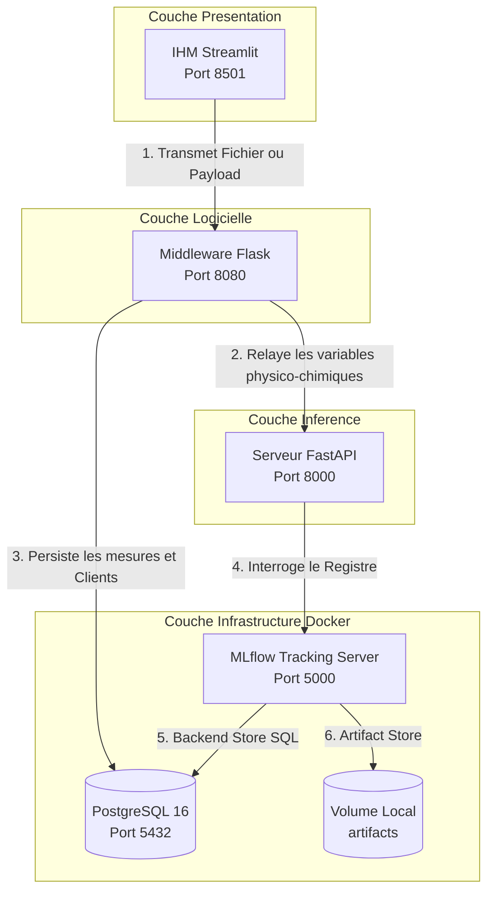

## Le schéma d’architecture technique.
##  Les choix techniques importants
- frameworks
- structure de l’API
- gestion de la clé API
- intégration OCR

## Architecture Technique (Waterflow 2)

## Schéma global de l'architecture

Les choix techniques importants
1. Découpage N-Tier et dissociation des ports
Pour éviter de saturer l'interface utilisateur et garantir une haute disponibilité, chaque composant est isolé sur son propre port d'écoute :

Streamlit (Port 8501) : Gère exclusivement la couche de présentation et l'affichage interactif.

Flask (Port 8080) : Agit comme l'unique point d'entrée centralisé (Middleware). Il découple le Front de l'Intelligence Artificielle, valide les structures et gère la base de données.

FastAPI (Port 8000) : Dédié à la performance brute de l'inférence mathématique et à l'application des garde-fous sanitaires de l'OMS.

2. Structure de l'API & Modularité
L'utilisation des Blueprints Flask permet de segmenter le routage réseau (avec le préfixe obligatoire /api/v1) de manière isolée dans src/middleware/routes.py. Cette approche évite les importations circulaires avec la fabrique d'application (create_app) tout en préparant l'application à une future intégration multi-tenant (gestion de plusieurs clients).

3. Architecture Réseau & Conteneurisation
Bascule sur l'image officielle ghcr.io/mlflow/mlflow:v2.11.3 afin de standardiser l'environnement de production. Pour surmonter l'absence native de drivers de base de données, l'injection du composant de liaison psycopg2-binary est orchestrée dynamiquement en mémoire au démarrage via un entrypoint bash sécurisé dans Docker.

4. Gestion des Secrets
Découplage strict entre la configuration et les données sensibles à l'aide d'un fichier d'environnement local .env (exclu du versionnage Git). Le fichier docker-compose.yml ne contient aucun mot de passe en clair, exploitant la syntaxe d'interpolation ${POSTGRES_PASSWORD} résolue à la volée par le moteur Docker.

**Flask** n'est pas un serveur d'affichage (IHM)   
C'est un Middleware / API REST Pure   
L'affichage (IHM) est géré à 100 % par Streamlit dans ton dossier front/   
Flask va uniquement :
- recevoir du JSON
- manipuler la base de données
- appeler l'OCR
- renvoyer du JSON.

## Architecture du Middleware (API Unifiée)

Pour répondre aux exigences d'industrialisation du projet Waterflow 2, nous avons fait le choix de consolider les différents services en une API principale structurée en modules. Cette architecture permet de partager une même base de code et une même base de données pour les différentes fonctionnalités (Data, Model, OCR).

Le cœur de cette logique est implémenté dans le dossier `src/middleware/` qui agit comme le chef d'orchestre de l'application :

* **`routes.py` (Routage et Endpoints) :** Centralise l'exposition des API. Il gère les trois routes principales demandées :
  * **API Data** (`/api/measurements`, `/api/clients`) : Pour le dépôt et la consultation des prélèvements filtrés par clé API client.
  * **API Model** (`/api/predict`) : Pour faire le pont avec le modèle de Machine Learning existant (Waterflow 1) via MLflow.
  * **API OCR** (`/api/ocr/lab-report`) : Pour la réception des fiches de laboratoire et le transfert au moteur d'extraction.
* **`bdd.py` (Couche Accès Données) :** Gère la connexion à la base de données relationnelle (PostgreSQL/MariaDB). Il assure la création des clients, la vérification des clés API (sécurité), et la persistance des prélèvements (norme RGPD et isolation des données par client).
* **`ocr_engine.py` (Service d'Ingestion Documentaire) :** S'occupe de la communication avec l'API tierce (ex: OCR.space). Il prend en charge l'envoi du fichier PDF/Image, la récupération du JSON renvoyé par l'OCR, et le parsing pour extraire les mesures physico-chimiques avant de les transmettre à la base de données.
* **`config.py` (Configuration Globale) :** Centralise la gestion des variables d'environnement (clés API externes, URI de la base de données, ports, etc.), assurant ainsi une conteneurisation Docker propre et sécurisée.

Cette architecture en middleware permet une séparation claire des responsabilités (separation of concerns), facilitant ainsi l'écriture de nos tests automatisés (unitaires et d'intégration) via PyTest.

### BDD - Comparatif : SQLite vs MariaDB vs PostgreSQL

#### SQLite : Le SGBD "Fichier" (Embarqué)
Principe : Il n'y a pas de serveur. Toute la base de données est stockée dans un seul fichier classique sur ton disque (comme le mlflow.db utilisé dans waterflow 1).

Avantages : 
- Zéro configuration
- ultra-léger
- parfait pour le prototypage ou les applications locales légères.

Inconvénients : 
- Très mauvaise gestion des accès simultanés (si deux clients écrivent en même temps, le fichier se verrouille).
- Pas de gestion avancée des droits d'utilisateurs.

#### MariaDB : Le SGBD "Serveur" Orienté Web (Équivalent Open Source de MySQL)
Principe : C'est un serveur indépendant qui tourne en arrière-plan.

Avantages : Ultra-rapide pour les opérations de lecture (très populaire pour les sites web de type WordPress/e-commerce), simple à prendre en main.

Inconvénients : Moins rigoureux sur le respect strict des contraintes SQL complexes et moins outillé pour les calculs analytiques ou la manipulation de données volumineuses/scientifiques.

#### PostgreSQL : Le SGBD "Serveur" Industriel & Analytique
Principe : Un serveur indépendant, connu pour être le SGBDR open source le plus puissant, le plus robuste et le plus respectueux des normes SQL standard.

Avantages : Gestion parfaite de la concurrence (des milliers de clients peuvent écrire en même temps), supporte des types de données complexes (JSON, géolocalisation), et intègre des fonctionnalités d'isolation indispensables pour la sécurité.

Inconvénients : Un peu plus lourd à configurer au départ, mais totalement transparent une fois encapsulé dans Docker.

#### Pourquoi choisir PostgreSQL :

- Conformité stricte au cahier des charges : Le sujet mentionne l'intégration d'une base de données PostgreSQL

- Architecture N-Tier et Concurrence : l'architecture va accueillir plusieurs profils d'utilisateurs :
    - le Client final
    - l'Analyste Qualité
    - le Responsable d'Exploitation

**SQLite** est exclu, car si un client injecte un rapport par OCR pendant qu'un analyste charge un dashboard, SQLite bloquerait l'application. **PostgreSQL** gère ces accès concurrents de manière isolée et ultra-sécurisée.

- Le standard de l'industrie en MLOps/Data Science : Dans le monde de l'intelligence artificielle et des données, **PostgreSQL** est le roi incontesté des bases relationnelles.
nativement supporté par MLflow pour remplacer le stockage par fichier instable.

- Facilité d'intégration avec Docker : Lever un serveur PostgreSQL dans l'infrastructure ne prend que quelques lignes dans le fichier docker-compose.yml en utilisant l'**image officielle** `postgres:latest`.

- Solidité industrielle

## Flask
La route de ton Front est standardisée : Dans front/app.py, la route d'appel devient officiellement http://localhost:8080/api/v1/analyse (gérée grâce au préfixe du Blueprint).

Aucun conflit : Flask tourne sur le port 8080, FastAPI sur le 8000, MLflow sur le 5000 et Streamlit sur le 8501.

**Blueprint** ("plan de construction" ou "maquette")
outil de Flask qui permet de découper les routes dans des fichiers séparés au lieu de devoir tout écrire dans un seul fichier géant.

Sans de Blueprint, il faut utiliser le décorateur @app.route()   
Mais pour faire ça, le fichier de routes a besoin de l'objet app   
L'objet app est créé dans __init__.py   
Au final, les fichiers s'importent les uns les autres en boucle.

Le Blueprint règle ce problème en déclarant des routes de manière isolée dans src/middleware/routes.py en disant
"Je prépare ces routes sur un plan de construction autonome   
Plus tard, Flask prendra ce plan et l'intégrera à l'application principale
