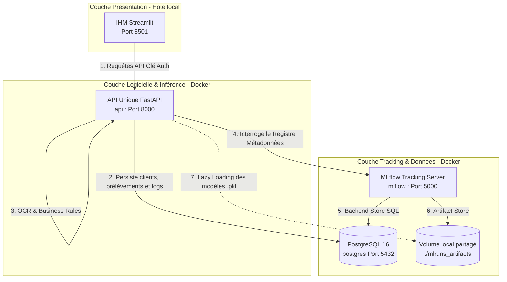

# Architecture Technique (Waterflow 2)

## Les choix techniques importants
- Frameworks & architecture : API Unique (FastAPI) unifiant Data, Inférence et OCR.
- Structure modulaire via les routeurs (`APIRouter`).
- Gestion de la clé API & Sécurité Réseau.
- Stratégie MLOps de Lazy Loading & Volume Partagé.

---

## Schéma global de l'architecture




---

### Les choix techniques justifiés

#### 1. L'API Unique (Architecture Monolithique Modulaire)

Contrairement au prototype Waterflow 1 (qui séparait Flask et FastAPI), Waterflow 2 consolide toute la logique backend dans un conteneur unique **FastAPI (Port 8000)**.
**Justification :** - Réduction de la complexité réseau (pas d'appels inter-services inutiles).

* Maintenance centralisée et documentation unifiée (Swagger auto-généré).
* FastAPI offre des performances asynchrones natives, idéales pour l'attente de l'OCR et le chargement des modèles.

#### 2. Structure de l'API & Modularité

L'utilisation des **APIRouter** permet de segmenter le code sans créer de microservices lourds. L'application est divisée dans `src/routes/` :

* `clients.py` : Création et gestion des clés API.
* `measurements.py` : API Data (dépôt et consultation des prélèvements filtrés par client).
* `predictions.py` : API Model (Inférence IA et garde-fous OMS).
* `ocr.py` : API OCR (Ingestion des fiches labo).

#### 3. Architecture MLOps et Lazy Loading

Pour résoudre les problèmes de désynchronisation au démarrage (Cold Start) et de dépendance forte à MLflow :

* **Séparation Registre / Stockage :** PostgreSQL stocke les métadonnées de MLflow, tandis qu'un volume Docker partagé (`./mlruns_artifacts`) stocke les fichiers binaires `.pkl`.
* **Lazy Loading :** L'API FastAPI ne charge pas les modèles au démarrage. Elle interroge MLflow à la volée lors de la première requête, télécharge la dernière version depuis le volume partagé, puis la met en cache (RAM) pour les requêtes suivantes.

#### 4. Architecture Réseau & Parade DNS Rebinding

L'infrastructure de calcul et de stockage est entièrement conteneurisée via Docker Compose.
Pour contrer la sécurité stricte d'Uvicorn au sein du réseau Docker isolé (erreur 403 HTTP *DNS rebinding* lors des appels internes vers MLflow), un patch intercepte et écrase l'en-tête `Host` à la volée dans l'API :

```python
import requests
_old_prepare_headers = requests.models.PreparedRequest.prepare_headers
def patched_prepare_headers(self, headers):
    _old_prepare_headers(self, headers)
    self.headers["Host"] = "localhost:5000"
requests.models.PreparedRequest.prepare_headers = patched_prepare_headers
```

---

## BDD - Comparatif & Choix de l'Infrastructure

### Pourquoi PostgreSQL ? (Le SGBD Industriel & Analytique)

1. **Gestion de la concurrence :** Indispensable puisque l'architecture accueille simultanément les requêtes du Front-end, l'ingestion OCR asynchrone et les logs du middleware HTTP.
2. **Support MLflow Natif :** Remplace l'ancien stockage SQLite instable pour centraliser le *Backend Store* de MLflow de manière persistante.
3. **Sécurité RGPD :** Permet la gestion relationnelle stricte entre les clés API (`clients`) et les historiques d'analyse (`prelevements`), garantissant qu'un client ne voit que ses propres données.
