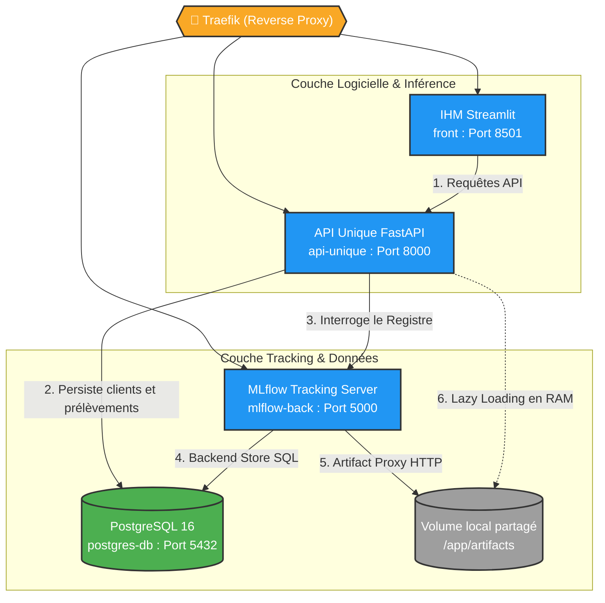

# Architecture Technique (Waterflow 2)

## Les choix techniques importants
- Frameworks & architecture : API Unique (FastAPI) unifiant Data, Inférence et OCR.
- Structure modulaire via les routeurs (`APIRouter`).
- Gestion de la clé API & Sécurité Réseau via Traefik.
- Stratégie MLOps : Artifact Proxy & Lazy Loading.

---

## Schéma global de l'architecture



---

### Les choix techniques justifiés

#### 1. L'API Unique (Architecture Monolithique Modulaire)

Contrairement au prototype Waterflow 1 (qui séparait Flask et FastAPI), Waterflow 2 consolide toute la logique backend dans un conteneur unique **FastAPI (Port 8000)**.
**Justifications :** * Réduction de la complexité réseau.

* Maintenance centralisée et documentation unifiée (Swagger auto-généré).
* FastAPI offre des performances asynchrones natives, idéales pour l'attente de l'OCR et le chargement réseau des modèles.

#### 2. Structure de l'API & Modularité

L'utilisation des **APIRouter** permet de segmenter le code sans créer de microservices lourds. L'application est divisée dans `src/routes/` :

* `clients.py` : Création et gestion des clés API.
* `measurements.py` : API Data (dépôt et consultation des prélèvements filtrés par client).
* `predictions.py` : API Model (Inférence IA et garde-fous OMS).
* `ocr.py` : API OCR (Ingestion des fiches labo).

#### 3. Architecture MLOps (Artifact Proxy & Lazy Loading)

Pour résoudre les problèmes de désynchronisation au déploiement distant :

* **Artifact Proxy :** MLflow est configuré avec le mode `--serve-artifacts`. Les modèles entraînés en local ne sont plus écrits directement sur le disque, mais envoyés par le réseau (HTTPS) à MLflow, qui se charge de les stocker de manière sécurisée sur le VPS.
* **Lazy Loading :** L'API FastAPI ne charge pas les modèles au démarrage. Elle interroge MLflow à la volée lors de la première requête, télécharge la dernière version, puis la met en cache (RAM).

#### 4. Reverse Proxy Traefik

L'exposition des services sur internet est gérée par **Traefik**. Il intercepte le trafic web (ports 80/443), génère les certificats SSL à la volée, et route intelligemment les requêtes vers les bons conteneurs Docker grâce aux sous-domaines (ex: `api.waterflow...`, `mlflow.waterflow...`).

---

### 2. Mise à jour de `docs/data_model.md`
*(Il faut juste modifier la section 3.C à la fin pour parler du Proxy)*

**Remplace uniquement la section "3. C." par ceci :**


### C. Dissociation Base de Données vs Artifact Proxy (MLOps)

Pour maintenir des performances optimales sur le SGBDR PostgreSQL, les fichiers binaires lourds des modèles d'IA (les `.pkl`) ne sont **pas** stockés sous forme de BLOBs (Binary Large Objects) dans les tables.

* La base PostgreSQL conserve uniquement **l'indexation MLflow** (Backend Store) et les données purement textuelles/numériques applicatives.
* Les fichiers physiques des algorithmes sont gérés par le serveur MLflow agissant comme un **Artifact Proxy** (`--serve-artifacts`). Lors d'un entraînement, les données sont expédiées via HTTP et stockées dans le dossier hôte `./mlruns_artifacts` monté comme volume Docker partagé. Cette architecture distribuée permet d'entraîner les algorithmes sur des machines locales puissantes tout en centralisant le stockage sur le VPS de production.

---

### 3. Mise à jour de `docs/bugfix.md`

*(On met à jour la résolution pour inclure le passage au mode "Proxy" et la suppression du hack DNS)*


# Gestion des Incidents : Désynchronisation d'état MLOps

Ce document décrit un scénario d'incident rencontré lors du passage en production de l'API Unique, son diagnostic et sa résolution.

## L'Incident : Le "State Mismatch" (Désynchronisation) et l'Erreur 404/503

**Symptôme :** Lors d'une requête de prédiction sur l'endpoint `/predict`, l'API renvoie une erreur 503 :
`{"detail":"Impossible de charger le modèle 'LogisticRegression' : No such file or directory"}`.
En parallèle, l'entraînement MLOps à distance échouait avec une erreur `404 Page Not Found`.

**Diagnostic :**
1. **Le Cold Start de l'API :** Si l'API cherche les modèles statiquement au démarrage (via le `lifespan`), elle plantera systématiquement si la BDD MLflow est encore vierge.
2. **Le Conteneur Égoïste :** Initialement, le script d'entraînement écrivait ses modèles dans un volume temporaire non partagé. MLflow avait l'index SQL, mais l'API ne trouvait pas les fichiers physiques.
3. **Le Hack DNS Rebinding Toxique :** Un patch Python forçait l'en-tête `Host: localhost:5000` pour contourner la sécurité Docker interne. Lors du passage en production, ce patch trompait le routeur **Traefik**, qui rejetait légitimement la requête avec une erreur 404.

---

## La Résolution

La correction a nécessité une refonte de l'architecture de tracking et de la logique de chargement.

### 1. Refonte Architecturale : Artifact Proxy et Traefik (`docker-compose.yml`)
Le hack DNS a été totalement supprimé. L'infrastructure s'appuie désormais sur Traefik pour le routage sécurisé, et MLflow a été configuré en mode **Proxy d'Artefacts**.

```yaml
  mlflow-back:
    # Le flag --serve-artifacts autorise MLflow à recevoir les modèles lourds via HTTP
    command: sh -c "exec mlflow server --backend-store-uri postgresql://... --serve-artifacts --artifacts-destination /app/artifacts --host 0.0.0.0 --port 5000"
    labels:
      - "traefik.http.routers.waterflow-mlflow.rule=Host(`mlflow.waterflow.lab.zanza-creation.com`)"

```

### 2. Implémentation du Lazy Loading Dynamique (Code API)

Plutôt que de charger les modèles au démarrage, l'API utilise le pattern **Lazy Loading** (Cache-Aside) avec une résolution dynamique de la dernière version via le réseau.

*Extrait de `src/routes/predictions.py` :*

```python
    # Si le modèle n'est pas en mémoire (Cache Miss), on cherche la dernière version à la volée
    if not model:
        try:
            client = MlflowClient()
            nom_registre = f"WaterModel_{payload.model_choice}"

            versions = client.search_model_versions(f"name='{nom_registre}'")
            derniere_version = max([int(v.version) for v in versions])
            model_uri = f"models:/{nom_registre}/{derniere_version}"

            # Téléchargement asynchrone depuis le Proxy MLflow
            model = mlflow.sklearn.load_model(model_uri)
            ml_models[payload.model_choice] = model

```

## Conclusion et Bénéfices

* **Résilience Totale :** L'API peut démarrer de façon asynchrone, avant même que les modèles ne soient entraînés (Cold Start sécurisé).
* **Entraînement Distribué :** L'entraînement se fait désormais sur le PC du développeur (WSL), et les modèles sont poussés de manière transparente via internet vers le VPS de production.
* **Mise à jour à chaud (Zero Downtime) :** Si un modèle est ré-entraîné, il suffit de vider le dictionnaire `ml_models` pour que la requête suivante télécharge automatiquement la nouvelle version sans redémarrer le backend.

