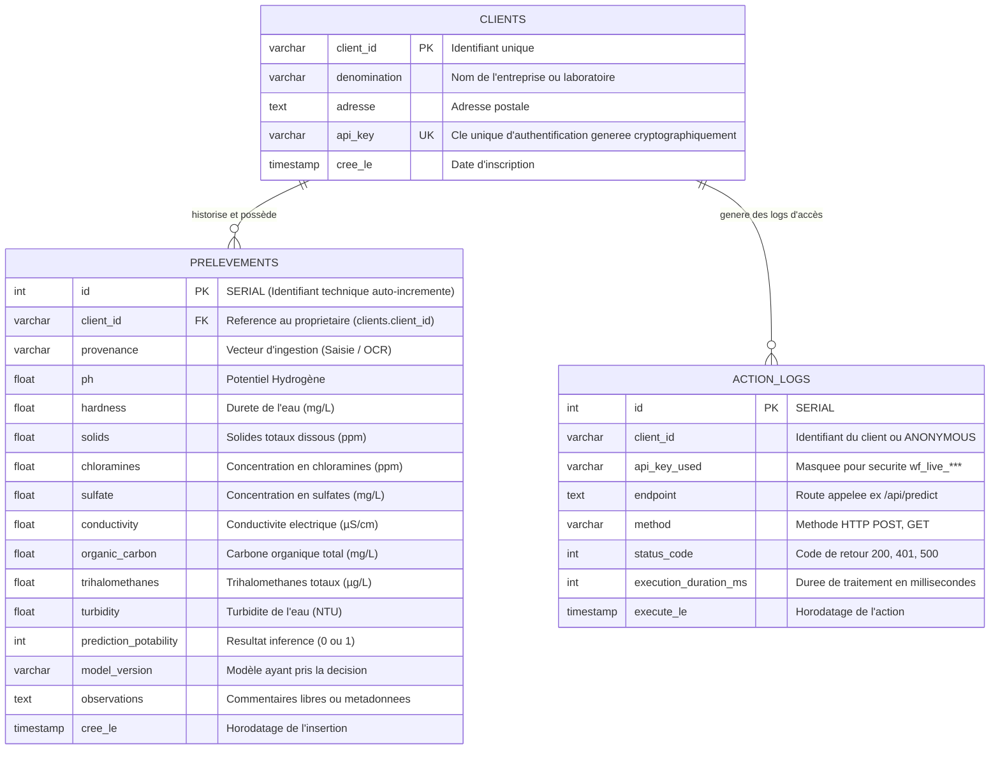

# Modèle de Données et Architecture BDD

Pour répondre aux exigences industrielles du projet, la persistance des données sous PostgreSQL est séparée en deux périmètres distincts :
1. **Le schéma de l'infrastructure MLOps** : Généré et géré de manière autonome par MLflow dans la base de données pour tracer les runs, paramètres, métriques et indexer les versions du Model Registry.
2. **Le schéma Applicatif métier** : Conçu sur mesure, initialisé par `src/config.py`, et requêté par l'API Unique FastAPI pour stocker les clients, les prélèvements et auditer la sécurité (logs).

---

## 1. Modèle Logique de Données (MLD)

Le dictionnaire de données métier s'articule autour de la traçabilité, du cloisonnement par entité cliente (RGPD), et du monitoring des performances de l'API.



---

## 2. Modèle Physique de Données (MPD) - DDL SQL

Voici les scripts réels d'implémentation de la structure relationnelle, exécutés automatiquement par l'API Unique (`init_db`) au démarrage sur l'instance PostgreSQL.

### Table `clients`

```sql
CREATE TABLE IF NOT EXISTS clients (
    client_id VARCHAR(50) PRIMARY KEY,
    denomination VARCHAR(100) NOT NULL,
    adresse TEXT,
    api_key VARCHAR(100) UNIQUE NOT NULL,
    cree_le TIMESTAMP DEFAULT CURRENT_TIMESTAMP
);

```

### Table `prelevements`

```sql
CREATE TABLE IF NOT EXISTS prelevements (
    id SERIAL PRIMARY KEY,
    client_id VARCHAR(50) REFERENCES clients(client_id),
    provenance VARCHAR(20) NOT NULL,
    ph FLOAT, hardness FLOAT, solids FLOAT, chloramines FLOAT,
    sulfate FLOAT, conductivity FLOAT, organic_carbon FLOAT,
    trihalomethanes FLOAT, turbidity FLOAT,
    prediction_potability INT,
    model_version VARCHAR(100),
    observations TEXT,
    cree_le TIMESTAMP DEFAULT CURRENT_TIMESTAMP
);

```

### Table `action_logs` (Monitoring MLOps & RGPD)

```sql
CREATE TABLE IF NOT EXISTS action_logs (
    id SERIAL PRIMARY KEY,
    client_id VARCHAR(50),
    api_key_used VARCHAR(100),
    endpoint TEXT,
    method VARCHAR(10),
    status_code INT,
    execution_duration_ms INT,
    execute_le TIMESTAMP DEFAULT CURRENT_TIMESTAMP
);

```

---

## 3. Spécifications techniques & Gouvernance des données

### A. Isolation Métier & Sécurité Multi-Tenancy

La présence de la colonne de liaison `client_id` (faisant référence au client) permet à l'API Unique FastAPI d'appliquer des politiques de filtrage strictes en amont de toute requête `GET`. Un utilisateur authentifié par sa clé d'API ne pourra requêter, visualiser ou modifier en base de données **que les prélèvements portant son propre identifiant**, garantissant un cloisonnement hermétique (Multi-Tenancy) requis par le RGPD.

### B. Monitoring Asynchrone (Middleware)

La table `action_logs` est alimentée via un *Middleware HTTP* dans FastAPI qui intercepte chaque requête. Il calcule le temps d'exécution (`execution_duration_ms`) et anonymise la clé API (`wf_live_********`) avant de l'écrire en BDD, garantissant qu'en cas de fuite de la base de données, les clés originelles ne sont pas exposées dans les logs en clair.

### C. Dissociation Base de Données vs Volume d'Artefacts (MLOps)

Pour maintenir des performances optimales sur le SGBDR PostgreSQL, les fichiers binaires lourds des modèles d'IA (les `.pkl`) ne sont **pas** stockés sous forme de BLOBs (Binary Large Objects) dans les tables.

* La base PostgreSQL conserve uniquement **l'indexation MLflow** et les données purement textuelles/numériques applicatives.
* Les fichiers physiques des algorithmes sont stockés dans le dossier hôte `./mlruns_artifacts` monté comme volume Docker partagé, respectant ainsi les best-practices de l'industrie (séparation Backend Store / Artifact Store).
