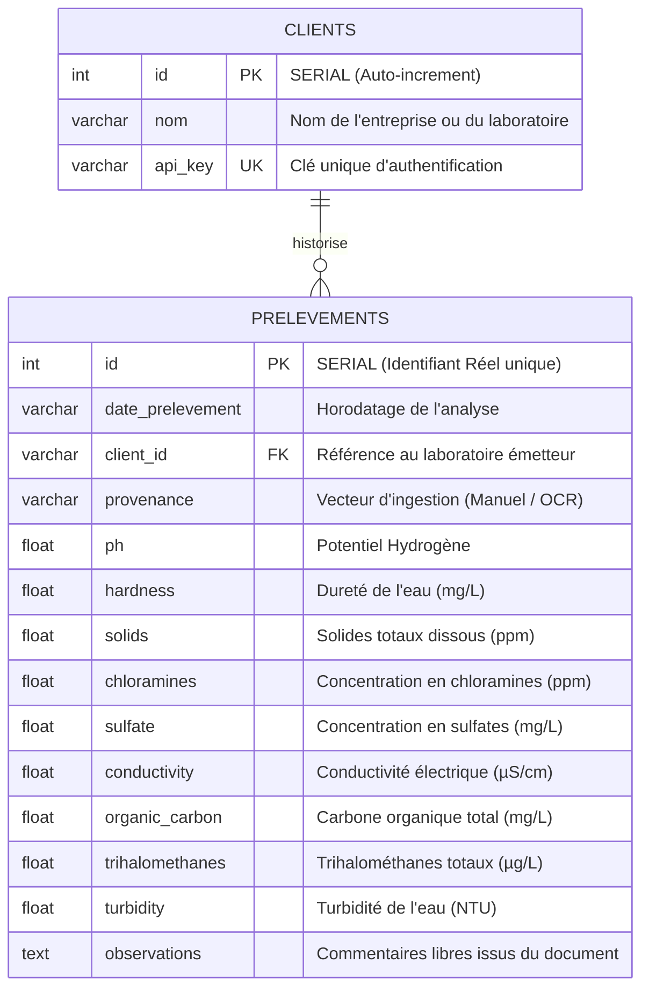

## MCD/MPD ou équivalent

# Le modèle de données

Pour répondre aux exigences industrielles du projet, la persistance des données sous PostgreSQL est séparée en deux périmètres distincts :
1. **Le schéma de l'infrastructure MLOps** : Généré et géré de manière autonome par MLflow pour tracker les runs, paramètres, métriques et versions de modèles.
2. **Le schéma Applicatif métier** : Conçu, initialisé par le script `src/middleware/bdd.py`, et requêté par le Middleware Flask pour tracer l'ingestion OCR et sécuriser les accès clients.

---

## 1. Modèle Logique de Données (MLD)

Le dictionnaire de données métier s'articule autour de la traçabilité multi-tenant (isolation des prélèvements par entité cliente de laboratoire) :



## 2. Modèle Physique de Données (MPD) - SQL DDL
Voici les scripts réels d'implémentation de la structure relationnelle appliqués sur l'instance `PostgreSQL` waterflow_db.

Table des Prélèvements (prelevements)
```SQL
CREATE TABLE IF NOT EXISTS prelevements (
    id SERIAL PRIMARY KEY,
    date_prelevement VARCHAR(50),
    client_id VARCHAR(50),
    provenance VARCHAR(50),
    ph FLOAT,
    hardness FLOAT,
    solids FLOAT,
    chloramines FLOAT,
    sulfate FLOAT,
    conductivity FLOAT,
    organic_carbon FLOAT,
    trihalomethanes FLOAT,
    turbidity FLOAT,
    observations TEXT
);
```

## 3. Spécifications techniques des contraintes
### A. Génération des Identifiants Réels (SERIAL)
Le choix du type de données SERIAL pour la clé primaire (id) délègue au moteur `PostgreSQL` la responsabilité de créer une séquence incrémentale.   

Lors de l'envoi d'une nouvelle analyse extraite par l'OCR, l'application omet volontairement cette colonne dans sa requête `INSERT`.   

`PostgreSQL` calcule et fige alors de manière centralisée et asynchrone le prochain index entier disponible (1, 2, 3, 4...)   

Cela élimine tout risque de collision ou d'identifiant factice généré en dur côté Python.

### B. Isolation Métier
La présence de la colonne de liaison `client_id` permet au Middleware Flask d'appliquer des politiques de filtrage strictes :   
un client authentifié par sa clé d'API ne pourra requêter et visualiser en base de données que les prélèvements portant son propre identifiant   

(Contrainte RGPD et cloisonnement de données).