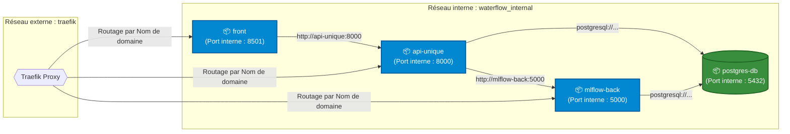
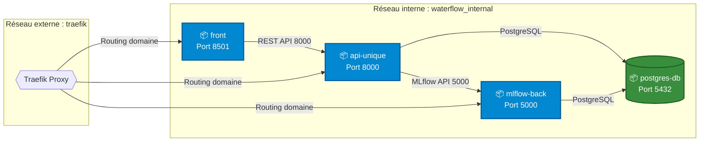

```mermaid
flowchart LR
    %% Définition des styles
    classDef container fill:#0288d1,stroke:#01579b,stroke-width:2px,color:#fff;
    classDef db fill:#388e3c,stroke:#1b5e20,stroke-width:2px,color:#fff;
    classDef network fill:#eceff1,stroke:#cfd8dc,stroke-dasharray: 5 5;

    subgraph "Réseau externe : traefik"
        Proxy{{"Traefik Proxy"}}
    end

    subgraph "Réseau interne : waterflow_internal"
        FRONT["📦 front<br/>(Port interne : 8501)"]:::container
        API["📦 api-unique<br/>(Port interne : 8000)"]:::container
        MLFLOW["📦 mlflow-back<br/>(Port interne : 5000)"]:::container
        DB[("📦 postgres-db<br/>(Port interne : 5432)")]:::db

        FRONT -- "http://api-unique:8000" --> API
        API -- "http://mlflow-back:5000" --> MLFLOW
        API -- "postgresql://..." --> DB
        MLFLOW -- "postgresql://..." --> DB
    end

    %% Expositions
    Proxy -- "Routage par Nom de domaine" --> FRONT
    Proxy -- "Routage par Nom de domaine" --> API
    Proxy -- "Routage par Nom de domaine" --> MLFLOW
```

```mermaid
flowchart LR
    %% Définition des styles
    classDef container fill:#0288d1,stroke:#01579b,stroke-width:2px,color:#fff;
    classDef db fill:#388e3c,stroke:#1b5e20,stroke-width:2px,color:#fff;

    subgraph "Réseau externe : traefik"
        Proxy{{"Traefik Proxy"}}
    end

    subgraph "Réseau interne : waterflow_internal"
        FRONT["📦 front<br/>Port 8501"]:::container
        API["📦 api-unique<br/>Port 8000"]:::container
        MLFLOW["📦 mlflow-back<br/>Port 5000"]:::container
        DB[("📦 postgres-db<br/>Port 5432")]:::db

        FRONT -->|REST API 8000| API
        API -->|MLflow API 5000| MLFLOW
        API -->|PostgreSQL| DB
        MLFLOW -->|PostgreSQL| DB
    end

    %% Expositions
    Proxy -->|Routing domaine| FRONT
    Proxy -->|Routing domaine| API
    Proxy -->|Routing domaine| MLFLOW
```
